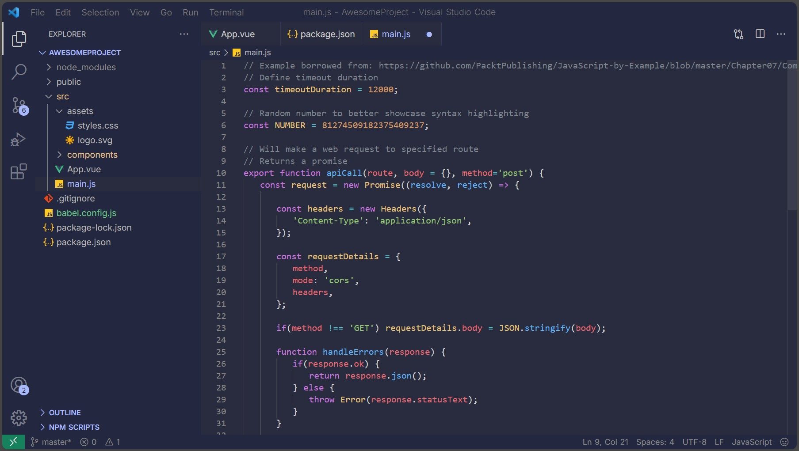

# Deep Space VS Code Theme

Minimal dark blue/violet theme for Visual Studio Code.

## Installation

Easy to install

- Navigate to your vs code folder
**Usually at:** @\AppData\Local\Programs\Microsoft VS Code\resources\app\extensions
- Drop here the folder **theme-deep-space**
- In vs code go to:  manage > Themes > Color Theme > **deep-space**
    

##Image

By 11093k
